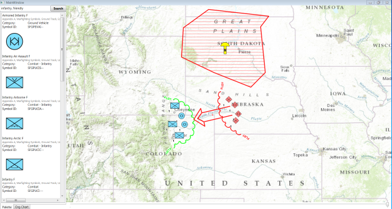

# coordinate-tool-addin-dotnet

This is an Esri ArcGIS Prototype Addin for ArcMAP 10.3 that can be used for converting coordinates.

 

## Features

* Parses input coordinates and outputs multiple formats of the input coordinate
* Addin for ArcMAP 10.3
* Works with DD, DMS, MGRS, USNG, GARS

## Sections

* [Requirements](#requirements)
* [Instructions](#instructions)
* [Resources](#resources)
* [Issues](#issues)
* [Contributing](#contributing)
* [Licensing](#licensing)

## Requirements

* Visual Studio 2013
* ArcGIS Desktop SDK for .NET 10.3
	* [ArcGIS Runtime for .NET Requirements](https://desktop.arcgis.com/en/desktop/latest/get-started/system-requirements/arcobjects-sdk-system-requirements.htm)

## Instructions

### General Help

* [New to Github? Get started here.](http://htmlpreview.github.com/?https://github.com/Esri/esri.github.com/blob/master/help/esri-getting-to-know-github.html)

### Getting Started with the Coordinate Tool Addin (.NET)

* Building
	* To Build Using Visual Studio
		* Open and build solution file
	* To use MSBuild to build the solution
		* Open a Visual Studio Command Prompt: Start Menu | Visual Studio 2013 | Visual Studio Tools | Developer Command Prompt for VS2013
		* cd coordinate-tool-addin-dotnet\source\CoordinateTool
		* msbuild CoordinateTool.sln /property:Configuration=Release

* Running
	* Run or debug from Visual Studio
	* To run from a stand-alone deployment
        * TBA 
		

## Resources

* [ArcGIS 10.3 Help](http://resources.arcgis.com/en/help/)
* [ArcGIS Blog](http://blogs.esri.com/esri/arcgis/)
* [@EsriDefense](http://twitter.com/EsriDefense)
* [ArcGIS Solutions Website](http://solutions.arcgis.com/military/)

## Issues

Find a bug or want to request a new feature?  Please let us know by submitting an [issue](https://github.com/ArcGIS/coordinate-tool-addin-dotnet/issues).

## Contributing

Anyone and everyone is welcome to contribute. Please see our [guidelines for contributing](https://github.com/esri/contributing).

## Licensing

Copyright 2015 Esri

Licensed under the Apache License, Version 2.0 (the "License");
you may not use this file except in compliance with the License.
You may obtain a copy of the License at

   http://www.apache.org/licenses/LICENSE-2.0

Unless required by applicable law or agreed to in writing, software
distributed under the License is distributed on an "AS IS" BASIS,
WITHOUT WARRANTIES OR CONDITIONS OF ANY KIND, either express or implied.
See the License for the specific language governing permissions and
limitations under the License.

A copy of the license is available in the repository's [license.txt](license.txt) file.

 
