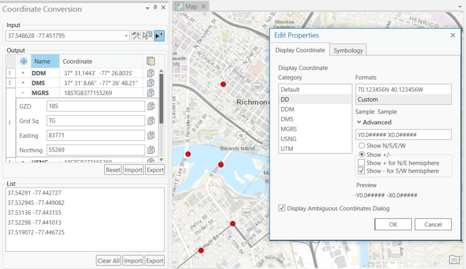

# coordinate-conversion-addin-dotnet

Coordinate Conversion window in ArcGIS Pro
Coordinate Conversion allows analysts to input and quickly convert coordinates between several common formats, including Universal Transverse Mercator (UTM) and Military Grid Reference System (MGRS). 

## Features

* Convert several coordinate formats in one dialog
* Copy coordinates to support other applications
* Customize output format for converted coordinates
* Import and export coordinate lists

## Sections

* [Requirements](#requirements)
* [Instructions](#instructions)
* [Resources](#resources)
* [Issues](#issues)
* [Contributing](#contributing)
* [Licensing](#licensing)

## Requirements

### Build Requirements 

* Visual Studio 2015
    * Important Note: Visual Studio 2013 [may also be required if building on ArcGIS 10.4.1-10.5.1](https://support.esri.com/en/technical-article/000012659)
* ArcGIS for Desktop 
	* ArcMap 10.4.1+
	* ArcGIS Pro 2.2+
* ArcGIS Desktop SDK for .NET 10.4.1+
	* [ArcGIS Desktop for .NET Requirements](https://desktop.arcgis.com/en/desktop/latest/get-started/system-requirements/arcobjects-sdk-system-requirements.htm)
* [ArcGIS Pro SDK](http://pro.arcgis.com/en/pro-app/sdk/) 2.2+

### Run Requirements

* ArcGIS for Desktop 
	* ArcMap 10.4.1+
	* ArcGIS Pro 2.2+

## Instructions

### General Help

* [New to Github? Get started here.](http://htmlpreview.github.com/?https://github.com/Esri/esri.github.com/blob/master/help/esri-getting-to-know-github.html)

### Getting Started with the Coordinate Conversion Addin (.NET)

## Development Environment 

* Building
	* To Build Using Visual Studio
		* Open and build solution file
	* To use MSBuild to build the solution
		* Open a Visual Studio Command Prompt: Start Menu | Visual Studio 2015 | Visual Studio Tools | Developer Command Prompt for VS2015
		* ` cd coordinate-conversion-addin-dotnet\source\CoordinateConversion `
		* ` msbuild CoordinateConversion.sln /property:Configuration=Release `
	* To run Unit test from command prompt
		* Open a Visual Studio Command Prompt: Start Menu | Visual Studio 2015 | Visual Studio Tools | Developer Command Prompt for VS2015
		* ` cd coordinate-conversion-addin-dotnet\source\CoordinateConversion\CoordinateConversionLibrary.Tests\bin\Release `
		* ` MSTest /testcontainer:CoordinateConversionLibrary.Tests.dll `
	* Note : Assembly references are based on a default install of the SDK, you may have to update the references if you chose an alternate install option

			
## Resources

* [Coordinate Conversion online documentation](http://solutions.arcgis.com/defense/help/coordinate-conversion/)
* [Military Tools for ArcGIS](https://esri.github.io/military-tools-desktop-addins/)
* [Military Tools for ArcGIS Solutions Pages](http://solutions.arcgis.com/defense/help/military-tools/)
* [ArcGIS for Defense Downloads](http://appsforms.esri.com/products/download/#ArcGIS_for_Defense)
* [ArcGIS Blog](http://blogs.esri.com/esri/arcgis/)
* [ArcGIS Solutions Website](http://solutions.arcgis.com/)

## Issues

Find a bug or want to request a new feature?  Please let us know by submitting an [issue](https://github.com/Esri/coordinate-tool-addin-dotnet/issues).

## Contributing

Anyone and everyone is welcome to contribute. Please see our [guidelines for contributing](https://github.com/esri/contributing).

## Repository Points of Contact 
Contact the [Military Tools team](mailto:defensesolutions@esri.com)

## Licensing
Copyright 2018 Esri

Licensed under the Apache License, Version 2.0 (the "License");
you may not use this file except in compliance with the License.
You may obtain a copy of the License at:

   http://www.apache.org/licenses/LICENSE-2.0.

Unless required by applicable law or agreed to in writing, software
distributed under the License is distributed on an "AS IS" BASIS,
WITHOUT WARRANTIES OR CONDITIONS OF ANY KIND, either express or implied.
See the License for the specific language governing permissions and
limitations under the License.

A copy of the license is available in the repository's [license.txt](./License.txt) file.

