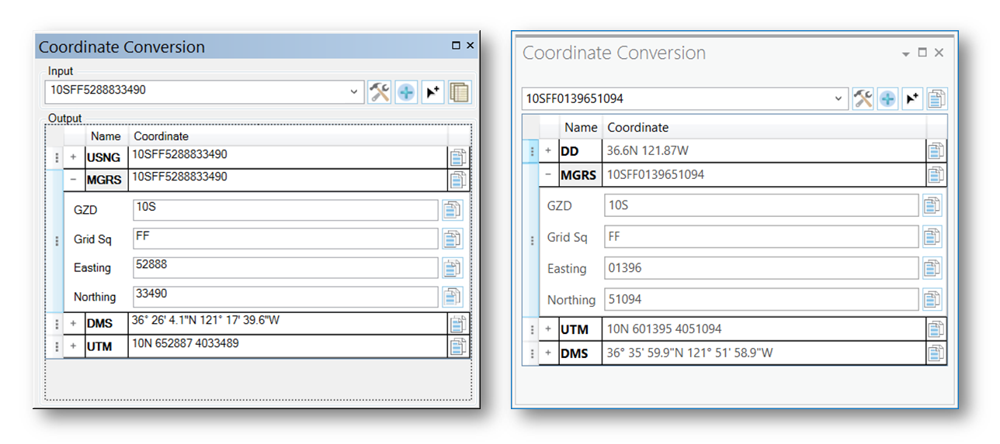

# coordinate-conversion-addin-dotnet

This is an Esri ArcGIS Prototype Addin for ArcMap 10.3.1 and Pro 1.2 that can be used for converting coordinates.




## Features

* Parses WGS1984 input coordinates and outputs multiple formats of the input coordinate
* Outputs can use pre-defined formats or can be customized to suit your needs
* Addin for ArcMap 10.3.1
	* Works with DD, DDM, DMS, GARS, MGRS, USNG and UTM
* Addin for ArcGIS Pro 1.2
	* Works with DD, DDM, DMS, GARS, MGRS, USNG and UTM

## Sections

* [Requirements](#requirements)
* [Instructions](#instructions)
* [Resources](#resources)
* [Issues](#issues)
* [Contributing](#contributing)
* [Licensing](#licensing)

## Requirements

### Devs

* Visual Studio 2013
* ArcGIS Desktop SDK for .NET 10.3.1
	* [ArcGIS Desktop for .NET Requirements](https://desktop.arcgis.com/en/desktop/latest/get-started/system-requirements/arcobjects-sdk-system-requirements.htm)
* ArcGIS Pro 1.2 SDK

### Users

* ArcGIS Desktop 10.3.1
* ArcGIS Pro 1.2

## Instructions

### General Help

* [New to Github? Get started here.](http://htmlpreview.github.com/?https://github.com/Esri/esri.github.com/blob/master/help/esri-getting-to-know-github.html)

### Getting Started with the Coordinate Conversion Addin (.NET)

## Development Environment 

* Building
	* To Build Using Visual Studio
		* Open and build solution file
	* To use MSBuild to build the solution
		* Open a Visual Studio Command Prompt: Start Menu | Visual Studio 2013 | Visual Studio Tools | Developer Command Prompt for VS2013
		* ``` cd coordinate-conversion-addin-dotnet\source\CoordinateConversion ```
		* ``` msbuild CoordinateConversion.sln /property:Configuration=Release ```
	* Note : Assembly references are based on a default install of the SDK, you may have to update the references if you chose an alternate install option

## Desktop Users
* Running
	* To run from a stand-alone deployment
		* ArcMap
			* Install the add-in from the latest Release on Github (https://github.com/Esri/coordinate-conversion-addin-dotnet/releases)
			* Add the add-in command to a toolbar via menu option 
				* "Customize -> Customize mode"
				* Select "Commands" Tab
				* Select "Add-In Controls"
				* Drag/Drop "Show Coordinate Conversion" command onto a toolbar
				* Close customize mode
				* Open tool by clicking the "Show Coordinate Conversion" command you just added
				* Dockable coordinate conversion tool appears
			* Optional : if you want share output formats, copy the "CoordinateConversionLibrary.dll.config" file to/from the following directory
				* ``` C:\Users\YOURUSERNAME\AppData\Local\ESRI\Desktop10.3\AssemblyCache\{19B92973-746A-4114-9232-3467CA1FC631} ```
					* Note : Windows will sometimes hide the AssemblyCache folder, to workaround this, type the folder name and press the 'Enter' key
				* A sample config file is provided in the application folder, otherwise a default config file will be automatically generated
		* Pro
			* Install the add-in from the latest Release on Github (https://github.com/Esri/coordinate-conversion-addin-dotnet/releases)
			* The ADD-IN appears under the "ADD-IN" tab in Pro	
			* Click the "Show Coordinate Conversion Tool Dockpane" button and the tool will appear
			* Optional : if you want to share output formats, copy the "CoordinateConversionLibrary.dll.config" file to/from the following directory
				* ``` C:\Users\YOURUSERNAME\AppData\Local\ESRI\ArcGISPro\AssemblyCache\{dfc85d8b-d2c1-405b-bd03-9a26740d842c} ```
					* Note : Windows will sometimes hide the AssemblyCache folder, to workaround this, type the folder name and press the 'Enter' key
				* A sample config file is provided in the application folder, otherwise a default config file will be automatically generated
			
* Map Point tool
	* Click on the **Map Point** button in the Input section of the *Coordinate Conversion* Tool.
	* As you move cursor over the map, coordinates will update in **Input** and **Output** boxes.
	* Click directly on the map using the cursor, the continuous updating of coordinates will stop.
	* The cursor’s coordinate location will automatically be populated in the **Input** text box.
	* Click in the **Input** box, hit <enter> on keyboard to flash the location point, and briefly show cross hairs at the coordinate location on map.
	* The **Input** coordinate will automatically be converted in the desired **Output** coordinate formats.

* Custom Formatters
	* Each coordinate type has its own custom formatter.  The following guide will help build a custom format string for each particular coordinate type.  If a character is not part of the formatting code it is simply transferred to the output string.
	* Configuration properties can be accessed by right clicking in the **Output** section on the row of the coordinate format to be customized.
	* Formatting numbers
		* Numbers found in DD, DDM and DMS can be formatted using the first three ("0" Zero placeholder, "#" digit placeholder and "." decimal point) characters found here [Custom Numeric Format Strings](https://msdn.microsoft.com/en-us/library/0c899ak8(v=vs.110).aspx)
		* Numbers found in GARS, MGRS, USNG and UTM can be formatted using the first two ("0" Zero placeholder and "#" digit placeholder) characters found here [Custom Numeric Format Strings](https://msdn.microsoft.com/en-us/library/0c899ak8(v=vs.110).aspx)
	* Formatting string output for each coordinate type
		* **DD** Decimal Degrees
			* "X" = Longitude
			* "Y" = Latitude
			* "+" = add "+" prefix if number is positive
			* "-" = add "-" prefix if number is negative
			* "N" or "S" = add "N" or "S" direction based on latitude
			* "E" or "W" = add "E" or "W" direction based on longitude
			* Example : "Y+-0.0 X+-0.0" will output "+41.1 -78.2"
		* **DDM** Decimal Degrees Minutes
			* "A" = Latitude Degrees
			* "B" = Latitude Minutes
			* "X" = Longitude Degrees
			* "Y" = Longitude Minutes
			* "+" = add "+" prefix if number is positive
			* "-" = add "-" prefix if number is negative
			* "N" or "S" = add "N" or "S" direction based on latitude
			* "E" or "W" = add "E" or "W" direction based on longitude
			* Example : "A0° B0.0#'N X0° Y0.0#'E" will output "41° 22.12'N 78° 36.45'W"
		* **DMS** Degrees Minutes Seconds
			* "A" = Latitude Degrees
			* "B" = Latitude Minutes
			* "C" = Latitude Seconds
			* "X" = Longitude Degrees
			* "Y" = Longitude Minutes
			* "Z" = Longitude Seconds
			* "+" = add "+" prefix if number is positive
			* "-" = add "-" prefix if number is negative
			* "N" or "S" = add "N" or "S" direction based on latitude
			* "E" or "W" = add "E" or "W" direction based on longitude
			* Example : "A0° B0' C0.0\"N X0° Y0' Z0.0E\"" will output "41° 22' 15.1"N 78° 36' 29.2"W"
				* Note : escape " like \" to get double quotes in the output
		* **GARS**
			* "X" = Longitude Band
			* "Y" = Latitude Band
			* "Q" = Quadrant
			* "K" = Key
			* Example : "X#YQK" will output "221LW37"
		* **MGRS/USNG**
			* "Z" = Grid Zone
			* "S" = Grid Segment
			* "X" = Easting
			* "Y" = Northing
			* Example : "Z S X00000 Y00000" will output "19T DE 14639 28236"
		* **UTM**
			* "Z" = Zone
			* "H" = Hemisphere
			* "X" = Easting
			* "Y" = Northing
			* "+" = add "+" prefix if number is positive
			* "-" = add "-" prefix if number is negative
			* Example : "Z#H X#m Y#m" will output "19N 414639m 4428236m"	
			
## Resources

* [ArcGIS 10.3 Help](http://resources.arcgis.com/en/help/)
* [ArcGIS Blog](http://blogs.esri.com/esri/arcgis/)
* [@EsriDefense](http://twitter.com/EsriDefense)
* [ArcGIS Solutions Website](http://solutions.arcgis.com/military/)

## Issues

Find a bug or want to request a new feature?  Please let us know by submitting an [issue](https://github.com/ArcGIS/coordinate-tool-addin-dotnet/issues).

## Contributing

Anyone and everyone is welcome to contribute. Please see our [guidelines for contributing](https://github.com/esri/contributing).

### Repository Points of Contact

#### Repository Owner: [Joe](https://github.com/jmccausland)

* Merge Pull Requests
* Creates Releases and Tags
* Manages Milestones
* Manages and Assigns Issues

#### Secondary: [Lyle](https://github.com/topowright)

* Backup when the Owner is away

## Licensing

Copyright 2015 Esri

Licensed under the Apache License, Version 2.0 (the "License");
you may not use this file except in compliance with the License.
You may obtain a copy of the License at

   http://www.apache.org/licenses/LICENSE-2.0

Unless required by applicable law or agreed to in writing, software
distributed under the License is distributed on an "AS IS" BASIS,
WITHOUT WARRANTIES OR CONDITIONS OF ANY KIND, either express or implied.
See the License for the specific language governing permissions and
limitations under the License.

A copy of the license is available in the repository's [license.txt](license.txt) file.

[](Esri Tags: Military Analyst Defense ArcGIS ArcObjects .NET WPF ArcGISSolutions ArcMap ArcPro Add-In)
[](Esri Language: C#) 
